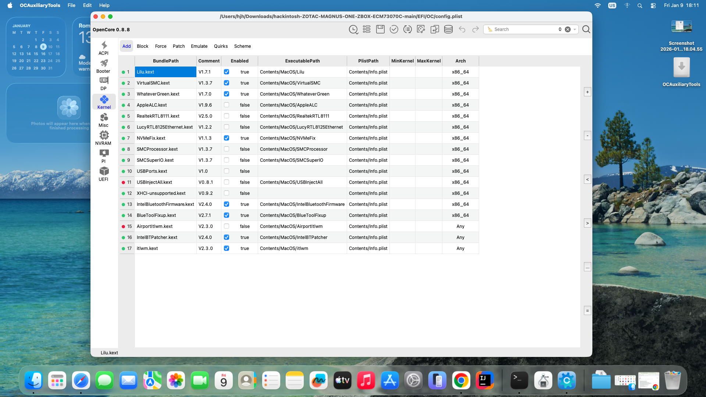
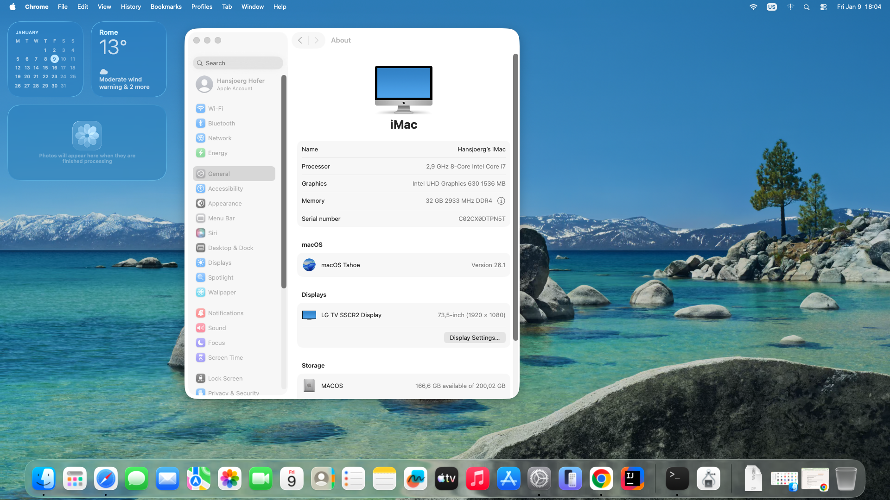

# ZOTAC MAGNUS ONE ZBOX‑ECM73070C Hackintosh (macOS Tahoe 26.1 + OpenCore 1.0.6)

This EFI is based on the original work from:  
https://github.com/farcop/hackintosh  
I updated it to the latest OpenCore, added fixes, and enabled full support for macOS Tahoe (macOS 26.1).

---

## Hardware

Model: **ZOTAC MAGNUS ONE ZBOX‑ECM73070C / 53060C**

- **CPU:** Intel Core i7‑10700 (Comet Lake)
- **Chipset:** Intel H470
- **iGPU:** Intel UHD 630 (used for macOS)
- **dGPU:** NVIDIA RTX 3070 (unsupported in macOS)
- **Ethernet 1:** Killer E3000 2.5G
- **Ethernet 2:** Realtek RTL8168/8111
- **Wi‑Fi / BT:** Killer AX1650x (Intel AX200)
- **Audio:** Realtek ALC269
- **RAM:** 32GB (2×16GB) Kingston Fury DDR4‑2933
- **SSD:** Crucial P3 Plus 1TB NVMe

---

## Software

- **Bootloader:** OpenCore 1.0.6 (Debug)
- **OS:** macOS Tahoe 26.1

---

## What’s NOT working

- **Bluetooth** (Intel Bluetooth unstable on macOS)
- **NVIDIA RTX 3070** (unsupported)
- **AirDrop / Handoff** (Intel Wi‑Fi limitation)
- **DRM** (Apple TV+, Netflix in Safari)
- **Sidecar** (Intel iGPU limitation)

---

## What IS working

- macOS Tahoe installation + boot
- Intel UHD 630 with LSPCON patches
- HDMI + DisplayPort output
- Audio (ALC269)
- Ethernet (Killer E3000 + Realtek RTL8111)
- USB (custom SSDT‑UIAC mapping)
- Intel Wi‑Fi (itlwm + HeliPort)
- Sleep / Wake
- NVMe SSD
- Shutdown / Restart
- iServices (iMessage, App Store, FaceTime, etc.)

---

## Device Layout

---

## Installation Guide (macOS Tahoe)

1. Download the macOS Tahoe vanilla installer from Olarila:  
   https://olarila.com/topic/6278-olarila-vanilla-images-macos-installer/
2. Flash the image to a USB stick using balenaEtcher:  
   https://etcher.balena.io/
3. Mount the USB EFI partition (recommended: MountEFI):  
   https://github.com/corpnewt/MountEFI
4. Clone this repository.
5. Open **Explorer++ as Administrator**:  
   https://explorerplusplus.com/download
6. Copy the **EFI** folder from this repo to the USB’s EFI partition.
7. Boot from the USB stick and install macOS.

---

## Config Validation

This EFI has been validated with **OCAT (OCAuxiliaryTools)**  
against **OpenCore DEV 1.0.6** with **0 conflicts**.

Download OCAT:  
https://github.com/ic005k/OCAuxiliaryTools/releases

---

## Wi‑Fi Notes (Important for macOS Tahoe)

macOS 15 (Tahoe) **does not support AirportItlwm.kext**.

This EFI uses:

- **itlwm_v2.3.0_stable.kext**  
- **HeliPort.app** (required for Wi‑Fi control)

### How to enable Wi‑Fi:

1. Boot macOS  
2. Install HeliPort.app:  
   https://github.com/OpenIntelWireless/HeliPort/releases  
3. Reboot twice  
4. Open HeliPort and connect to your Wi‑Fi network  

⚠️ The macOS Wi‑Fi menu will always show **“No Wi‑Fi hardware installed”** — this is expected.

---

## BIOS Settings

- BIOS Version: **2K211028**
- Enable **iGPU**
- Disable **Secure Boot**
- Disable **Fast Boot**
- SATA Mode: **AHCI**
- Boot Mode: **UEFI only**
- Disable **CSM**
- Enable **Above 4G Decoding**
- DVMT Pre‑Allocated: **64MB or 128MB** (if available)

---

## Troubleshooting

### OpenCore not appearing in BIOS
Run in Windows CMD (Admin):

bcdedit /set {bootmgr} path \EFI\OC\OpenCore.efi

### Black screen after boot
- Ensure LSPCON patches are active  
- Reset NVRAM

### No Wi‑Fi
- HeliPort not installed  
- Wrong itlwm version

### No audio
- Reset NVRAM  
- Check ALC269 layout-id

---

## Credits

- **farcop** — original EFI base  
- **OpenCore team** — bootloader  
- **OpenIntelWireless** — itlwm + HeliPort  
- **Dortania** — documentation  
- Community testers and contributors  

---

## 🔍 SEO Keywords (for better Google visibility)

**Hackintosh ZOTAC Magnus One**  
**ECM73070C OpenCore**  
**ZBOX Hackintosh**  
**Intel i7‑10700 Hackintosh**  
**UHD630 macOS Tahoe**  
**OpenCore EFI Download**